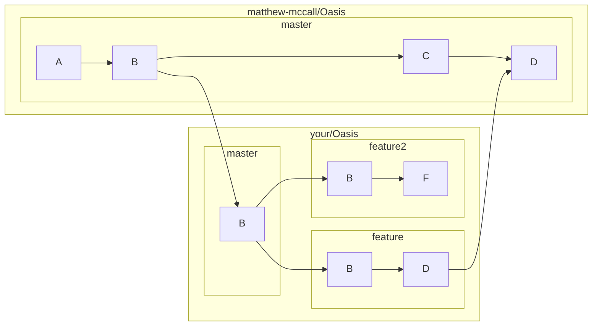

# Code Style
We use a format based off [WebKit](https://webkit.org/code-style-guidelines/). We provide a `.clang-format` and we recommend using ClangFormat to ensure consistent formatting.
# Git Courtesies
Before making any changes, create a new branch within your fork and work on that branch. This keeps the master branch free to then fast-forward changes from upstream. When you make a pull request, pull request from that branch directly to upstream. For continued work, make a new branch from your fast-forwaded main after your changes are merged.

