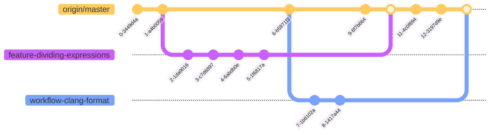

# Contributing Guidelines

*Pull requests, new issues, bug reports, and any other kinds of contribution are welcome and encouraged!*

## Submitting Pull Requests

For contributing to the project, please follow our pull request workflow:

1. [Fork this repository](https://docs.github.com/en/get-started/quickstart/fork-a-repo) and [create a local clone](https://docs.github.com/en/repositories/creating-and-managing-repositories/cloning-a-repository).

2. Create a new branch in your repository. For the branch name, we recommend following this convention:
    * Use dashes as separators to increase readability. For example, `feature-dividing-expressions`.
    * Start the branch name with one of the following categories:
        * `feature` for adding, removing, or modifying a feature
        * `bugfix` for fixing bugs
        * `doc` for writing documentation
        * `workflow` for working with software workflows, like GitHub Actions or CMake
    * Avoid long branch names. Keep branch names as short as possible, while only providing necessary details. For example, instead of `workflow-new-action-for-clang-format`, use `workflow-clang-format`.

3. Keep all of your work on your branch. It is almost never a good idea to push your commits directly to your `master` branch. If you ever find youself needing to pull in new changes into your branch, consider [rebasing your branch](https://git-scm.com/book/en/v2/Git-Branching-Rebasing).

4. Once you're done with your work, make sure that all of your changes are pushed to the remote repository (i.e., onto GitHub).

5. We mandate that all pull requests follow our [coding style guidelines](#code-style). Part of this process involves manually running one of the GitHub Actions workflows. Please follow [this](https://docs.github.com/en/actions/using-workflows/manually-running-a-workflow) tutorial to run the `Format CMake` workflow on your working branch.

6. Now, make a pull request to merge with the upstream `master` branch. For the subject line of the pull request, follow our [naming convention](#pull-request-naming-convention). Make sure that all CI/CD runs pass. If there are merge conflicts, you are reponsible for [resolving them](https://docs.github.com/en/pull-requests/collaborating-with-pull-requests/addressing-merge-conflicts/resolving-a-merge-conflict-on-github). If you need help, please feel free to reach out to one of the project maintainers for assistance.

7. Once your pull request is squashed and merged with the `master` branch, you can sync your fork by pulling from upstream. You can delete your working branch as well.

8. Hooray, you successfully contributed to the project! If you learn better with visualizations, see the [diagram below](#workflow-diagram).

## Pull Request Naming Convention

We adopt a standard naming convention for pull request subject lines. Here are some guidelines:
* Limit the subject line to 72 characters.
* Capitalize the subject line.
* Do not end the subject line with punctuation.
* Use the imperative mood (e.g. `Add integration` instead of `Adds integration` or `Adding integration`).
* Prefix the title with the same category you used in your branch (e.g. `[Feature] Add Logarithms` or `[Doc] Improve CONTRIBUTING.md`).

## Code Style

We strive to follow WebKit's [coding style guidelines](https://webkit.org/code-style-guidelines/). Additionally, we use `clang-format` to keep the formatting of our C++ code consistent. Here are some additional guidelines this project follows:
- We always use the trailing return syntax (Yes, WebKit says otherwise)
- We try to reduce nesting as much as possible. For instance, prefer early return patterns.
- Try to use the "declarative syntax" for building expressions. I.e, nested braced initialization.

When it comes to coding style, consistency is extremely important. Be sure to follow the existing style, format, and naming convention in the file(s) you are modifying. This is also enforced by GitHub Actions workflows. Unfortunately, this is not as automatic as we'd like. To run these workflows, you need to manually run them from GitHub.

## Visualized Workflow

In the diagram, `origin/master` is the `master` branch of the upstream repository. The branches `feature-dividing-expressions` and `workflow-clang-format` are branches on a developer's fork. Each dot on the diagram represents a commit or merge, labeled with a unique identifier.

